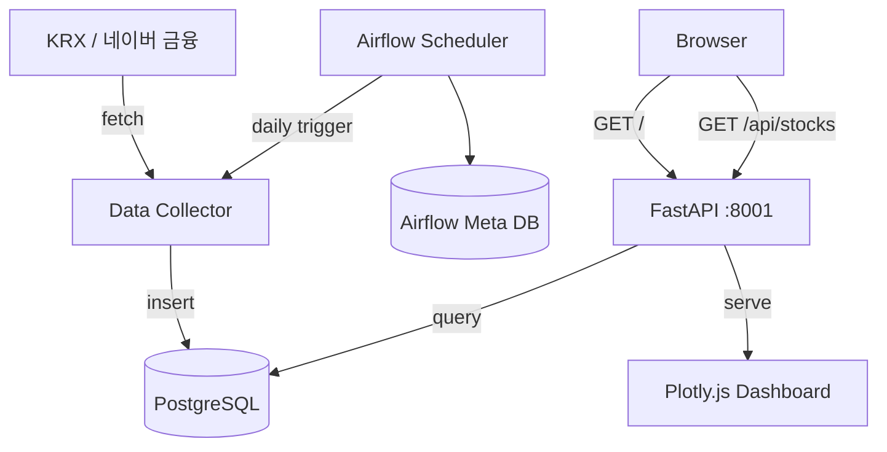

# 📈 금융 데이터 분석 & 시각화 대시보드

> **데이터 엔지니어 포트폴리오** — 한국 주식 시장 데이터 수집 및 분석 플랫폼

한국 주식 시장 데이터를 KRX/네이버 금융에서 수집하고 Airflow로 정기 파이프라인을 운영하며, FastAPI와 Plotly.js로 대시보드를 제공합니다.

---

## 🏗️ 아키텍처



## 🔧 기술 스택

| 계층 | 기술 |
|------|------|
| 백엔드 | Python + FastAPI |
| 파이프라인 | Apache Airflow 2.9 |
| DB | PostgreSQL 16 |
| 데이터 | FinanceDataReader (KRX + 네이버 금융) |
| 시각화 | Plotly.js (Vanilla HTML) |
| 인프라 | Docker Compose |

## 📊 수집 데이터

| 종목 | 코드 | 시장 |
|------|------|------|
| 삼성전자 | 005930 | KOSPI |
| SK하이닉스 | 000660 | KOSPI |
| NAVER | 035420 | KOSPI |
| 카카오 | 035720 | KOSPI |
| KOSPI 지수 | KS11 | 지수 |
| KOSDAQ 지수 | KQ11 | 지수 |

## 🚀 실행 방법

```bash
# 모든 서비스 실행
docker compose up -d

# Airflow 접속 (admin / admin)
open http://localhost:8080

# 대시보드 접속
open http://localhost:8001

# API 호출
curl http://localhost:8001/api/stocks
curl http://localhost:8001/api/stocks/005930/history
```

## 📈 대시보드 기능

- **종목별 캔들스틱 차트** (OHLCV + 이동평균선 MA5/MA20)
- **종목 리스트 테이블** (코드, 최신가, 변동률)
- **다크 테마** UI

## 🔄 Airflow DAG

```
korean_finance_collector
  └─ schedule: 0 7 * * 1-5 (UTC)
  └─ task: collect_financial_data
```
